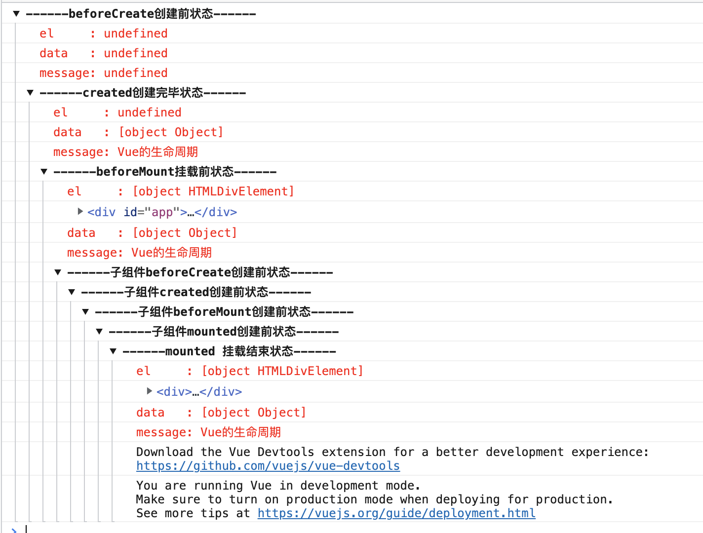
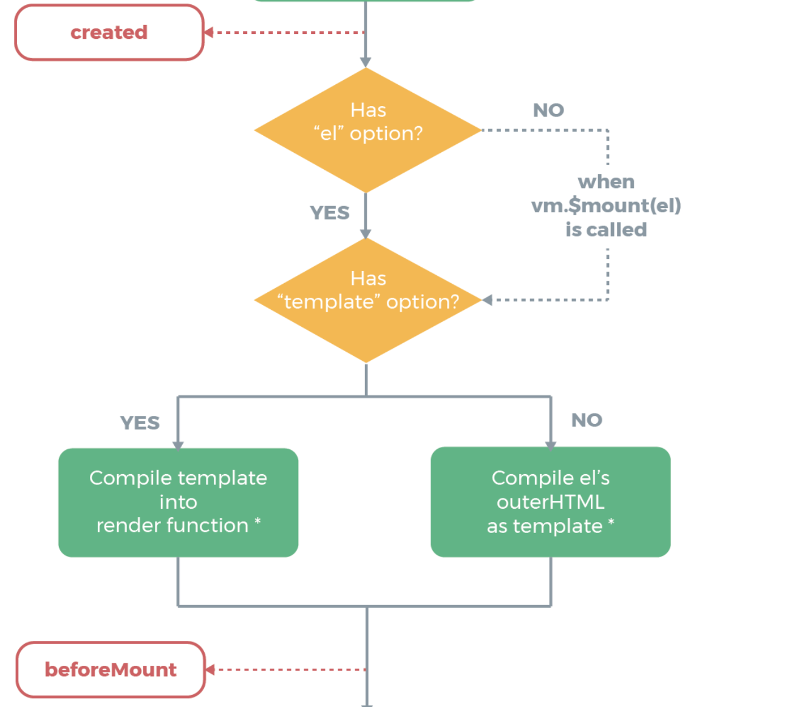
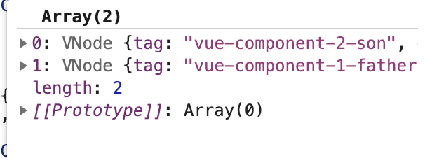

## vue 的生命周期


vue实例被创建之前要经过一系列的初始化操作，这整个过程就是 vue 的生命周期。在这个初始化期间的某些阶段会暴露出一些勾子函数供开发者添加自己的代码，这些勾子函数包括：

* beforeCreate
* created
* beforeMount
* mounted
* beforeUpdate
* updated
* beforeDestroy
* destroyed

在浏览器运行一下，各勾子函数的调用情况：



#### beforeCreate 到 created

可以看到 beforeCreate 这时候还不能访问到 data,created 之后才能访问到。这期间进行的数据观测、事件初始化等操作。

#### created 到 beforeMount



首先判断有没有 el选项(提供挂载的 dom，如：el: '#app')，没有的话会停止直到调用$mount(el)。 

接着判断有没有 template 选项，有 template 选项的话，将 template 编译成 render 函数，没有的话将 el的 outHTML 作为 template 编译成 render 函数，用来生成自身的 vnode。这里其实是简略了，最开始其实是判断有没有提供 render 函数，如果有 render 函数就忽略 template了，所以优先级是 render > template > el's outerHTML

#### beforeMount 到 mount

这里面其实发生了很多事情，但是图上只简单的标明了创建了vm.$el并且替换掉挂载的 dom 元素，所以mount 这边都能获取到真实的 dom了

#### beforeUpdate 到 updated

当数据发生变化，重新渲染前会调用 beforeUpdate 渲染后调用 updated

#### beforeDestory 到 destoryed

beforeDestory 后开始执行销毁实例的操作，销毁执行完毕调用 destoryed，所以 beforeDestory 仍然可以获取实例。

-------------------------------------------
### 代码层面分析
#### beforeCreate & created

``` js
Vue.prototype._init = function (options?: Object) {
  // ...
  initLifecycle(vm)
  initEvents(vm)
  initRender(vm)
  callHook(vm, 'beforeCreate')
  initInjections(vm) // resolve injections before data/props
  initState(vm)
  initProvide(vm) // resolve provide after data/props
  callHook(vm, 'created')
  // ...
}

function initState (vm: Component) {
  // 初始化组件的watcher列表
  vm._watchers = []
  const opts = vm.$options
  if (opts.props) initProps(vm, opts.props)
  if (opts.methods) initMethods(vm, opts.methods)
  if (opts.data) {
    // 初始化data
    initData(vm)
  } else {
    observe(vm._data = {}, true /* asRootData */)
  }
  if (opts.computed) initComputed(vm, opts.computed)
  if (opts.watch && opts.watch !== nativeWatch) {
    initWatch(vm, opts.watch)
  }
}
```

beforeCreate 和 created的调用发生在 initState 前后，initState会分别对props、methods、data、computed、watcher进行初始化，所以要在 created 之后才能访问到 props、methods...这些

#### beforeMount & mounted

``` js
export function mountComponent (
  vm: Component,
  el: ?Element,
  hydrating?: boolean
): Component {
  vm.$el = el
  // ...
  callHook(vm, 'beforeMount')

  let updateComponent
  /* istanbul ignore if */
  if (process.env.NODE_ENV !== 'production' && config.performance && mark) {
    updateComponent = () => {
      const name = vm._name
      const id = vm._uid
      const startTag = `vue-perf-start:${id}`
      const endTag = `vue-perf-end:${id}`

      mark(startTag)
      const vnode = vm._render()
      mark(endTag)
      measure(`vue ${name} render`, startTag, endTag)

      mark(startTag)
      vm._update(vnode, hydrating)
      mark(endTag)
      measure(`vue ${name} patch`, startTag, endTag)
    }
  } else {
    updateComponent = () => {
      vm._update(vm._render(), hydrating)
    }
  }

  // we set this to vm._watcher inside the watcher's constructor
  // since the watcher's initial patch may call $forceUpdate (e.g. inside child
  // component's mounted hook), which relies on vm._watcher being already defined
  new Watcher(vm, updateComponent, noop, {
    before () {
      if (vm._isMounted) {
        callHook(vm, 'beforeUpdate')
      }
    }
  }, true /* isRenderWatcher */)
  hydrating = false

  // manually mounted instance, call mounted on self
  // mounted is called for render-created child components in its inserted hook
  if (vm.$vnode == null) {
    vm._isMounted = true
    callHook(vm, 'mounted')
  }
  return vm
}
```

beforeMount发生在vm.render()(渲染 VNode)之前，等 path 到真实 dom 之后执行了mounted，所以在 mounted 才能访问到真实的 dom。不过这里有一个判断 vm.$vnode 是空的时候才执行，new Vue 的时候才会执行 mounted，而组件的初始化不在这边执行。

*组件 mounted 执行时间：*

``` js
function invokeInsertHook (vnode, queue, initial) {
  // delay insert hooks for component root nodes, invoke them after the
  // element is really inserted
  if (isTrue(initial) && isDef(vnode.parent)) {
    vnode.parent.data.pendingInsert = queue;
  } else {
    for (var i = 0; i < queue.length; ++i) {
      queue[i].data.hook.insert(queue[i]); // 这里调用 insert函数， queue 如下图所示
    }
  }
}

const componentVNodeHooks = {
  // ...
  insert (vnode: MountedComponentVNode) {
    const { context, componentInstance } = vnode
    if (!componentInstance._isMounted) {
      componentInstance._isMounted = true
      callHook(componentInstance, 'mounted')
    }
    // ...
  },
}

```
其中queue队列中保存的是所有子组件的 Vnode，如下图所示，顺序是先子后父，所以 mounted 的执行顺序也是先子后父




#### beforeUpdate & updated

``` js
export function mountComponent (
  vm: Component,
  el: ?Element,
  hydrating?: boolean
): Component {
  // ...

  // we set this to vm._watcher inside the watcher's constructor
  // since the watcher's initial patch may call $forceUpdate (e.g. inside child
  // component's mounted hook), which relies on vm._watcher being already defined
  new Watcher(vm, updateComponent, noop, {
    before () {
      if (vm._isMounted) {
        callHook(vm, 'beforeUpdate')
      }
    }
  }, true /* isRenderWatcher */)
  // ...
}

function flushSchedulerQueue () {
  //...
  // Sort queue before flush.
  // This ensures that:
  // 1. Components are updated from parent to child. (because parent is always
  //    created before the child)
  // 2. A component's user watchers are run before its render watcher (because
  //    user watchers are created before the render watcher)
  // 3. If a component is destroyed during a parent component's watcher run,
  //    its watchers can be skipped.
  queue.sort(function (a, b) { return a.id - b.id; });
  for (index = 0; index < queue.length; index++) {
    watcher = queue[index];
    if (watcher.before) {
      watcher.before();
    }
    //...
    watcher.run() // 更新dom
  }
  //...
  callUpdatedHooks(updatedQueue);
}

function callUpdatedHooks (queue) {
  var i = queue.length;
  while (i--) {
    var watcher = queue[i];
    var vm = watcher.vm;
    if (vm._watcher === watcher && vm._isMounted && !vm._isDestroyed) {
      callHook(vm, 'updated');
    }
  }
}
```
beforeUpdate的调用是在 watcher.before 里面，会有一个判断vm._isMounted为 true 的时候，才会执行。beforeUpdate 的执行入注释里面所说，updated from parent to child，因为是父元素先创建的。updated 是在更新完之后调用的，顺序如代码所示是倒序调用的，所以父子调用顺序关系为 父 beforeCreated -> 子 beforeCreated -> 子 updated -> 父 updated
#### beforeDestroy & destroyed

``` js
Vue.prototype.$destroy = function () {
  const vm: Component = this
  if (vm._isBeingDestroyed) {
    return
  }
  callHook(vm, 'beforeDestroy')
  vm._isBeingDestroyed = true
  // remove self from parent
  const parent = vm.$parent
  if (parent && !parent._isBeingDestroyed && !vm.$options.abstract) {
    remove(parent.$children, vm)
  }
  // teardown watchers
  if (vm._watcher) {
    vm._watcher.teardown()
  }
  let i = vm._watchers.length
  while (i--) {
    vm._watchers[i].teardown()
  }
  // remove reference from data ob
  // frozen object may not have observer.
  if (vm._data.__ob__) {
    vm._data.__ob__.vmCount--
  }
  // call the last hook...
  vm._isDestroyed = true
  // invoke destroy hooks on current rendered tree
  vm.__patch__(vm._vnode, null)
  // fire destroyed hook
  callHook(vm, 'destroyed')
  // turn off all instance listeners.
  vm.$off()
  // remove __vue__ reference
  if (vm.$el) {
    vm.$el.__vue__ = null
  }
  // release circular reference (#6759)
  if (vm.$vnode) {
    vm.$vnode.parent = null
  }
}
```
beforeDestroy和 destroyed 在$destroy执行的，销毁前调用beforeDestroy，执行过程中vm.__patch__(vm._vnode, null)会递归的销毁子组件，destroyed 的执行顺序是反过来的，beforeDestroy和 destroyed的执行顺序也是：父 beforeDestroy -> 子 beforeDestroy -> 子 destroyed -> 父 destroyed

[Vue.js 技术揭秘](https://ustbhuangyi.github.io/vue-analysis/v2/components/lifecycle.html#beforecreate-created)
[详解vue生命周期](https://segmentfault.com/a/1190000011381906)
[vue 实例化过程](https://www.cnblogs.com/gerry2019/p/12001661.html)


