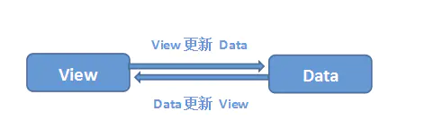

## 双向绑定原理

双向绑定是通过视图层的更新来改变数据，同时数据的改变又能反应在视图层上。比如通过 input 输入改变 data ，同时改变的data 又能反映在视图层上。



### vue 是怎么实现双向绑定的？

Observer 监听器，遍历 data，通过Object.defineProperty实现对每个属性进行劫持，当读取属性(触发 get 操作)的时候会在收集器 dep 里 push 一个 watcher，当赋值的时候（触发 set操作）便会去遍历 dep 里面 watcher，逐个去更新。

Watcher 是订阅者，解析模板的时候会首次触发属性的 get 操作，这个时候就会往收集器里面添加这个订阅，并且通知更新视图。

Dep 是订阅收集器，每个属性都有一个单独的收集器 dep，当这个属性的值发生变化时会遍历收集器里面的 watcher 进行更新。

Compile 是解析器，对模板数据、指令进行解析初始化，初始化的时候会读取属性这个时候就会新增一个订阅者 watcher，watcher 初始化的时候会读取属性的值触发 get 操作，这时候订阅收集器收收集到了这个订阅。

```js
  // Dep收集器实现
  function Dep() {
    this.watchers = []
  }
  Dep.prototype = {
    addWatcher(watcher) {
      this.watchers.push(watcher)
    },
    notify() {
      this.watchers.forEach(watcher => {
        watcher.update() // 通知 watcher 更新
      })
    }
  }
  Dep.target = null // 
  // Observer 实现
  function Observer(obj) {
    Object.keys(obj).forEach(key => {
      defineReactive(obj, key, obj[key])
    })
  }
  function defineReactive(obj, key, val) {
    const dep = new Dep()

    Object.defineProperty(obj, key, {
      get() {
        if (dep.target) {
          // watcher 初始化的时候会将 target 指向自身
          // 只有初始化的时候才会添加订阅者
          dep.addWatcher(Dep.target)
          return val
        }
      },
      set(newVal) {
        if (newVal === val) return
        val = newValue
        dep.notify()
      }
    })
  }
  // Watcher实现
  function Watcher(vm, node, name) {
    // 初始化时候将 Dep.target 指向自己
    // 调用 get，添加watcher 到对应的dep中
    // 以后数据有变动会调用 set，会通知到 watcher
    // 将 Dep.target 重置为 null

    Dep.target = this
    this.vm = vm
    this.node = node
    this.name = name
    this.update()
    Dep.target = null
  }

  Watcher.prototype = {
    update() {
      this.get()

      // 这里泛指更新 dom 里面的值
      this.node.value = this.value
    },
    get() {
      // 会触发 get操作，获取最新值
      // 如果是初始化时，Dep.target 指向自身，会被收进 Dep里面
      this.value = this.vm.data[this.name]
    }
  }
```


[简单的mvvm实现，有助于理解 vue 的源码](https://github.com/dailc/mini-mvvm/blob/master/helloworld/mvvm_helloworld.html)

