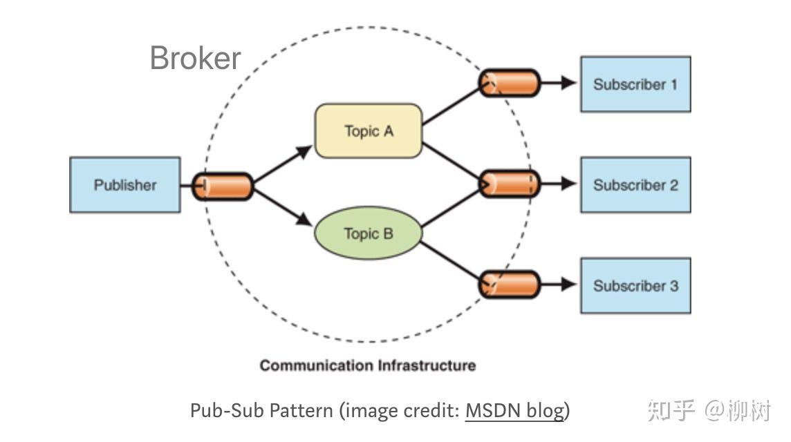

## 发布者订阅模式

严格区分的话，观察者模式(Observer pattern)和发布者订阅模式(Publisher-Subscriber pattern)是有区别的。

### 观察者模式(Observer pattern)

这种设计模式中被观察者（Subject）维护了一套观察者(Observer)的合集，当状态改变时，被观察者会通过调用方法的方式自动通知观察者，实现了主体对象和观察者对象之间的松耦合。

*举个栗子：假设你想要应聘 A 公司的前端程序员一职位，你把简历投给 A 公司，A 公司从简历上获取了你的联系方式告诉你 A 当前没有职位空缺并会在有职位空缺的时候告诉你。除了你之外也有别的候选人想应聘A 公司的职位，这时候公司就维护了所有候选人的列表，当 A 公司有职位空缺时会通知这些候选人。所以 A 公司就相当于Subject，候选人相当于Observers。当有职位空缺时，A 公司会自动通知候选人，而不需要候选人实时打电话询问。*


### 发布者订阅模式(Publisher-Subscriber pattern)

发布者订阅模式中，发布者和订阅者互相不知道对方的存在，实现了真正的完全解耦。这里面存在一个中间经纪人，过滤所有的消息并且分发给所有的订阅者。



这两种模式在思路上是一致的，所以有时候不区分也正常，业务复杂取决了你是否要加入中间这一层。

#### 发布者订阅模式实现

```js
const pubSub = (function() {
  const subscribers = {}

  function publish(eventType, data) {
    if (!Array.isArray(subscribers[eventType])) return

    subscribers[eventType].forEach(fn => {
      fn(data)
    })
  }

  function subscribe(eventType, fn) {
    if (!Array.isArray(subscribers[eventType])) {
      subscribers[eventType] = []
    }
    const index = subscribers[eventType].push(fn) - 1

    return function() {
      subscribers[eventType].splice(index, 1)
    }
  }

  return {
    publish,
    subscribe
  }
})()


pubSub.subscribe('holiday', function(data) {
  console.log(data + '放假')
})
const unsubscribe = pubSub.subscribe('start-of-school', function(data) {
  console.log(data + '开学！')
})

pubSub.publish('holiday', '6月5号') // 消息一旦发布就会打印"放假时间"
unsubscribe() // 小明先订阅了开学时间，之后决定辍学便取消了订阅
pubSub.publish('start-of-school', '九月1号') // 之后再发布开学消息，小明也不会收到了
```


[观察者模式 vs 发布者模式](https://hackernoon.com/observer-vs-pub-sub-pattern-50d3b27f838c)

[观察者模式 vs 发布者模式-知乎版](https://zhuanlan.zhihu.com/p/51357583)

[发布订阅者实现](https://jsmanifest.com/the-publish-subscribe-pattern-in-javascript/)

